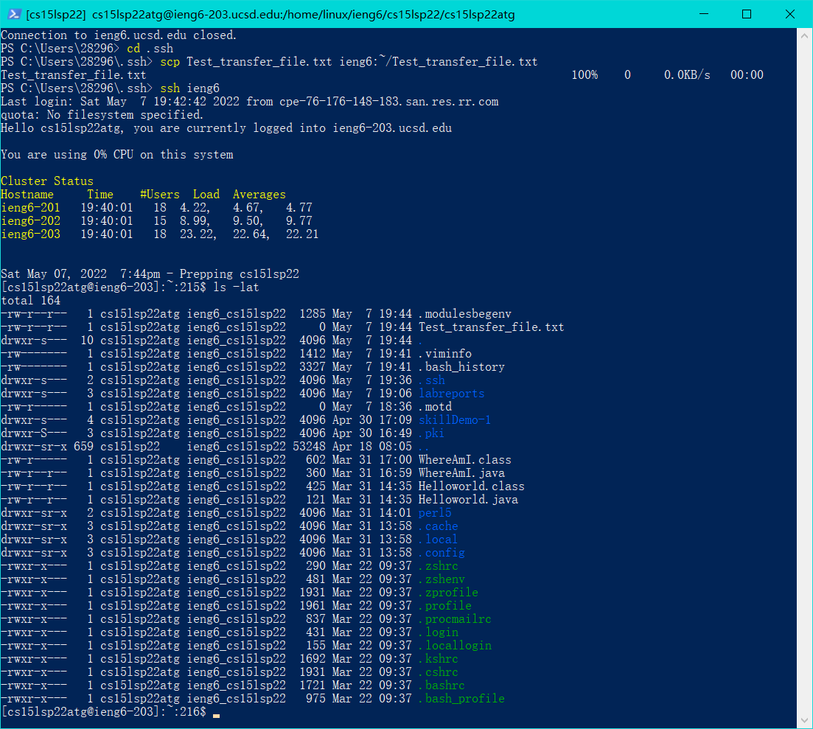

# this is the lab report for week 5-6 lab<br />
<br />

# Streamlining ssh Configuration

<br />

By adding a config file in ~/.ssh folder, we can access remote server with login user to make ssh connection even easier.

<br />

## Find .ssh folder and create a new file config in it


<br />

You can use software like VS code to edit it and put in specific config for each remote server.

<br />

## what I put into the config file:


<br />

```
Host ieng6
    HostName ieng6.ucsd.edu
    User cs15lsp22atg
```

These lines of code means: 

For hostname ieng6.ucsd.edu, we give it a nickname ieng6

The default user we use to login is cs15lsp22atg

<br />

<br />

## After setting this config file up, we can use simpler command to connect to server


<br />

```
ssh ieng6
```

<br />

We already set the nickname and default username for server, so we can use a very simple ieng6 to represent the whole sentence before

## SCP also works the same way


<br />

```
scp Test_transfer_file.txt ieng6:~/Test_transfer_file.txt
```

By substituting the whole server address and username to ieng6, SCP works the same way

<br /><br /><br />

# Setup Github Access from ieng6

<br />

Using ssh-keygen, we can create a new ssh key and use it to get access to github.

## I put my public key in server's .ssh folder.

<br />


<br />

<br />

## Then, copy the content of public key to this [page](https://github.com/settings/keys) in github

<br />


<br />

## Make sure the private key is also in your local folder


<br />

<br />

<br />

After doing these, you should get the access to pull/push commits to github.

## Go to a local repo to test it


Before you can push to github, you still need to change the way git communicate with github to SSH using the code below.

```
git remote set-url origin (SSH url for this repo)
```

You can check this [link](https://github.com/anananan116/cse15l-lab-reports/commit/5912344cc3e8f6237bcc304f26289f45ae85de06) to see the commit I push.


<br /><br /><br /><br />

The End:
---

**Thank you for reading this lab report.** <br/>