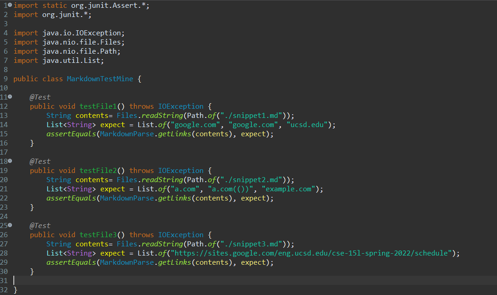
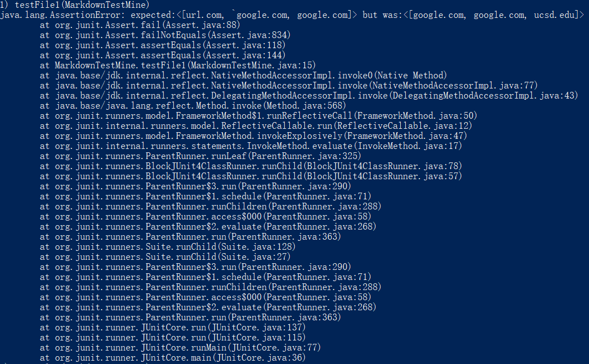
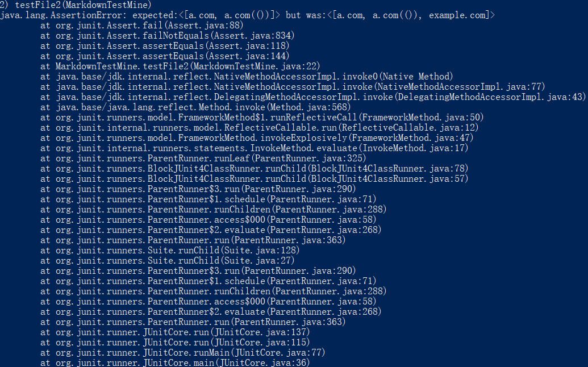
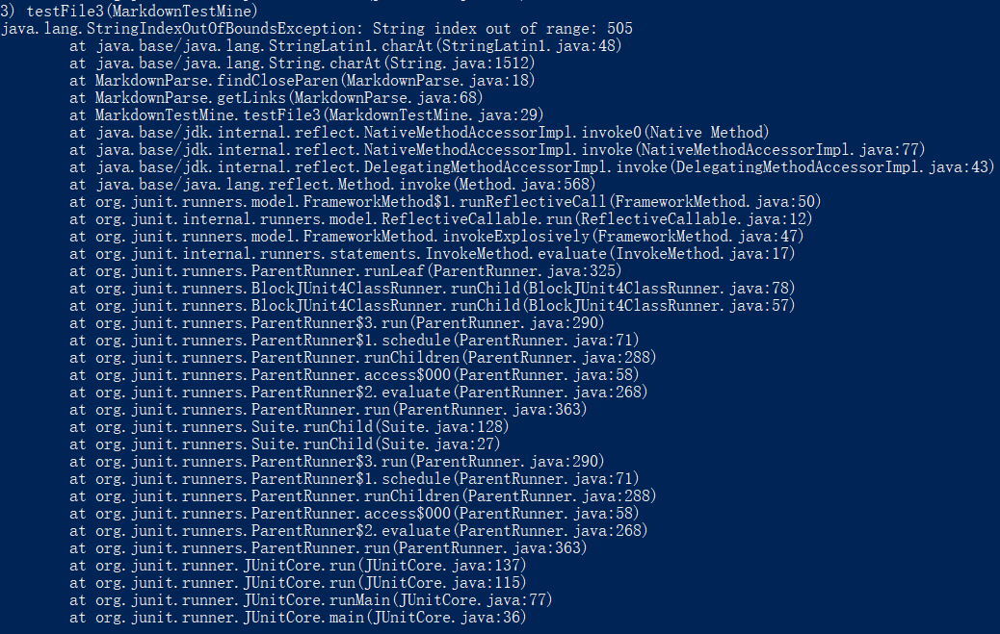
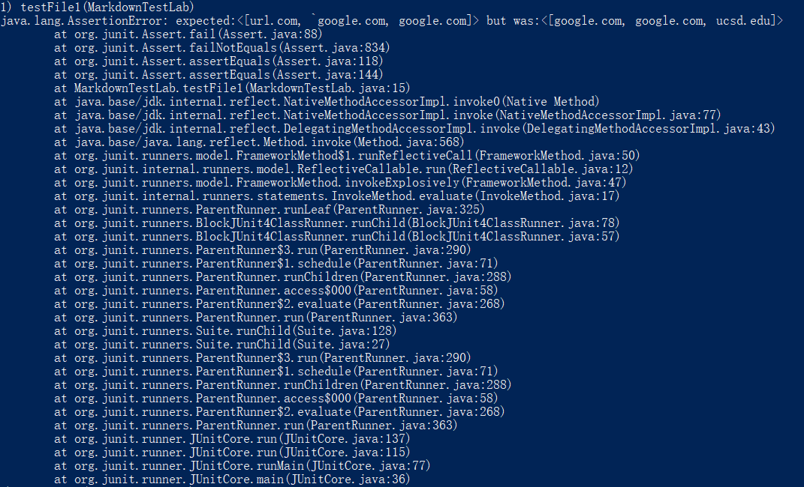
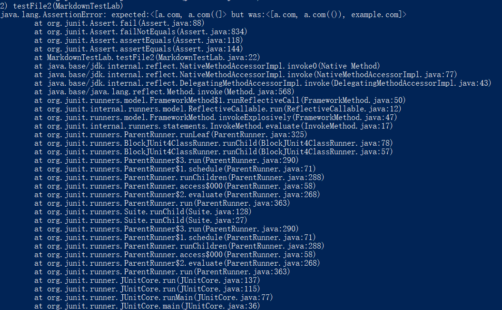
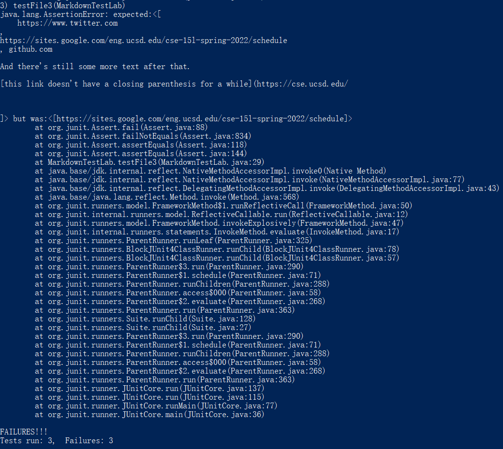

# this is the lab report for week 7-8 lab<br />
<br />

Link for my [MarkdownParse](https://github.com/anananan116/markdown-parser) repository

Link for [MarkdownParse](https://github.com/ujik500/markdown-parser) repository we used in lab 7

<br />
<br />

## Expected Output

<br />

Snippet 1:
```
["google.com", "google.com", "ucsd.edu"]
```

Snippet 2:
```
["a.com", "a.com(())", "example.com"]
```

Snippet 3:
```
["https://sites.google.com/eng.ucsd.edu/cse-15l-spring-2022/schedule"]
```
<br />

## My test for three Snippets

<br />
This is how I put the three snippets into the junit tests.

<br />



<br />
<br />

## Test for my MarkdownParse

My MarkdownParse failed on all three tests

The output are listed below:




<br />



<br />



The MarkdownParse we used in lab 7 also failed on all three tests

The output are listed below:




<br />



<br />



## Possible improvement

Snippet 1:

I think it's impossible to fix the code with a small code change. There are two possibilities for the mark `

```
[another link](`google.com)`
```

```
[`code]`](ucsd.edu)
```

If ` is in the square bracket, then it ignore any square bracket inside it. If it is outside, then it is taken as a normal character. I think it's imppossible to distinguish and solve both situations in 10 lines of code.

<br />

<br />

Snippet 2:

I think it's possible to fix it in 10 lines of code. I can add an while statement to check if it has a \ in front of the square bracket. If so, we do not see it as a bracket but only see it as a part of the text. It will be somthing like this:

```
int nextOpenBracket = markdown.indexOf("[", currentIndex);

while(nextOpenBracket - 1>=0 && (!markdown.charAt(nextOpenBracket-1).equals("\"))){
    nextOpenBracket = markdown.indexOf("[", nextOpenBracket+1);
}
```

We can do something like this to the close bracket

Snippet 3:

I don't think I can fix it in 10 lines of code. But first we can fix the bug it is causing. I can add a if statement to check if the closeParen is out of bound. But there are too many situations about links and name of the link in different lines and I think 10 lines of code cannot distinguish them all.

<br /><br /><br /><br />

The End:
---

**Thank you for reading this lab report.** <br/>