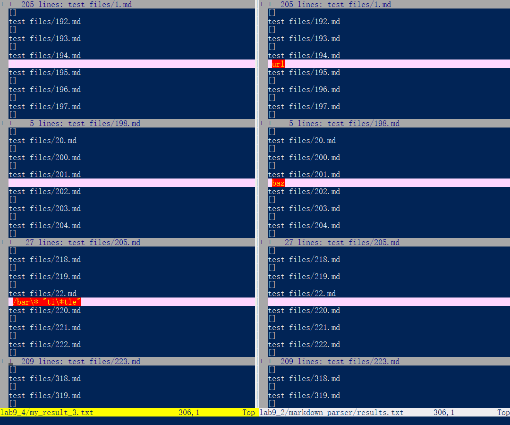
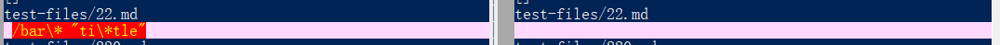
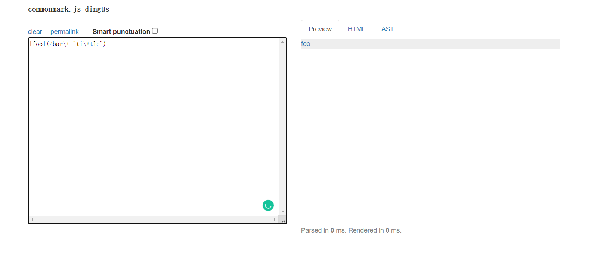
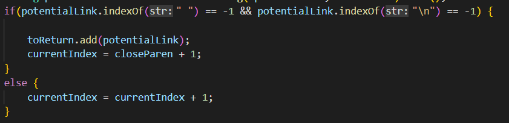
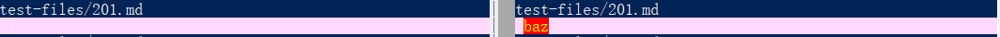
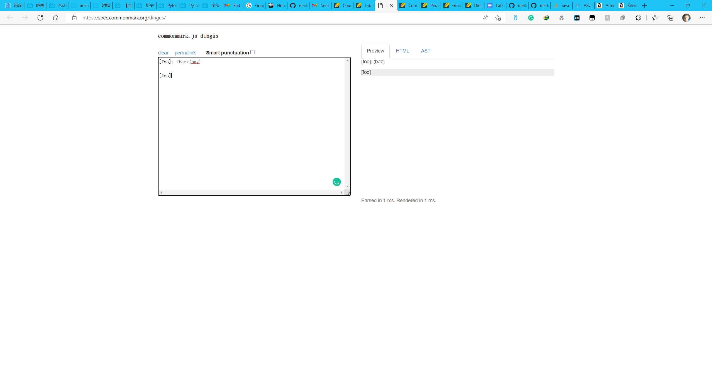
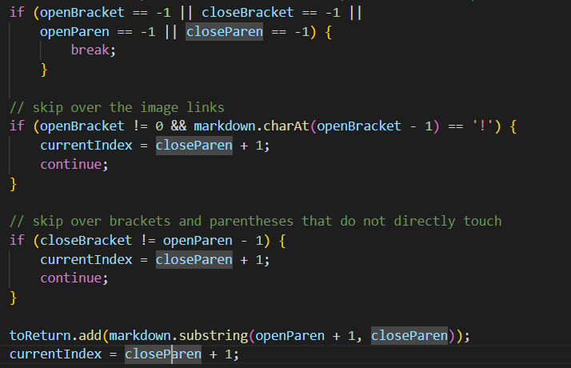

# this is the lab report for week 9-10 lab<br />

<br />

## Finding different results:

<br />

I found different results by using command vimdiff on the result after running the bash. It immediately visualizes all the different lines, which is more effcient than manual work.



The two test files that has different results on two implementations I will talk about today are:

## [First](https://github.com/anananan116/markdown-parser/blob/main/test-files/22.md?plain=1)

## [Second](https://github.com/anananan116/markdown-parser/blob/main/test-files/201.md?plain=1)


<br />

# First Test Case



The different output is shown above. (My implementation on the left, provided implementation on the right)

<br /><br />

Actually, both implementation fails to find the right link in this test case. 



We can see the link is actually valid, but the right links should be:

```
[ti*tle]
```

So both implementations are wrong.

<br /><br />

I will talk about why the probided implementation fails this test since it fails to reconize it as a valid link.




In the condition of if statment:

```
potentialLink.indexOf(" ") == -1
```

Only links that does not have any space between () will be added to the result.
However, this test case contains a special rule that only take the second part of the link as the result. So, one way of solving this is to look up this kind of result and use another if statement in else to reconize those special rules and deal with them case by case.

<br /><br />

# Scond Test Case



The different output is shown above. (My implementation on the left, provided implementation on the right)

<br /><br />

And my implementation find the wrong result.



We can see the link is not valid, so the right result should be:

```
[]
```

My implementation is wrong because it contians "baz".

<br /><br />




In my implementation, I forgot to check whether [] and () are connected to each other. Only if the ( symbol is one charactor after the ] symbol, the link could be valid. A very simple solution here would be adding a if statament to check openParen - closeBracket == 1.

<br /><br /><br /><br />

The End:
---

**Thank you for reading this lab report.** <br/>