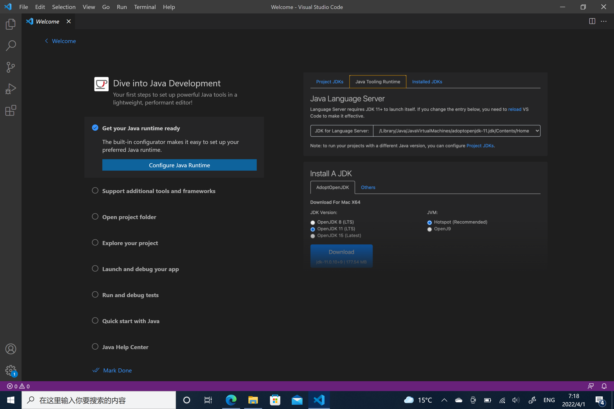

# this is the lab report for week 1 lab<br />
<br />

## 1. Install VS code
<br /><br/><br/><br/>
Go to [VS code](https://code.visualstudio.com/) website t download the latest version of vs code and then install it.<br />
<br/>
<br/>

## 2. Remotely Connecting
<br /><br/><br/><br/>
First, istall [Open SSH](https://docs.microsoft.com/en-us/windows-server/administration/openssh/openssh_install_firstuse) on their website. Then, you need to look up the course-specific account and password for the lab on [here](https://sdacs.ucsd.edu/~icc/index.php)
<br/>
<br/>
Type in the line of code:
```
ssh account@ieng6.ucsd.edu
```
Then the passoword. Then you should see the welcome message.
<br/>

## 3. Try Some Command


<br/><br/><br/><br/>
I tried some basic commands here. The intresting one is:

<br/>

```
ls -lat
```

it means:
>List all the files, show hidden files, from newest to oldest, use long listing format.

## 4. Move Files With SCP

<br/>


<br/><br/><br/><br/>

Here, I moved the java file WhereAmI.java to the remote server using the scp command:

```
scp "filename" account@ieng6.ucsd.edu:~
```
<br/>
Then, we can see the file have been copied using command 

`ls`
 to list the files. I also tried to run java program on this server using:

 ```
javac WhereAmI.java
java WhereAmI
 ```
 We can see the output of its current location.

 ## 5. Setting SSH keys
 

 <br/><br/><br/><br/>

 As shown in the picture, I connect the the server without using the password. I did that with SSH keys.
 <br/>
 First, use the command:

 ```
 ssh-keygen
 ```
to generate a SSH key.

<br/>

Use the command on server:

```
 mkdir .ssh
 ```
to make a new folder on the server to store public key.

<br/>

Then, use scp to copy the public key to the server.
```
scp /Users/<user-name>/.ssh/id_rsa.pub account@ieng6.ucsd.edu:~/.ssh/authorized_keys
```
<br/>

I was on Windows, so I need this extra step to  allow the system to use this SSH key.

In powershell Admisnistrator, use command:

```
# By default the ssh-agent service is disabled. Allow it to be manually started for the next step to work.
# Make sure you're running as an Administrator.
Get-Service ssh-agent | Set-Service -StartupType Manual

# Start the service
Start-Service ssh-agent

# This should return a status of Running
Get-Service ssh-agent

# Now load your key files into ssh-agent
ssh-add ~\.ssh\"Name of your public key"
```

<br/>
Then, you should have access to the server without password.

## 6. Optimize remote running

<br/><br/><br/><br/>
With SSH keys, we can use one single line of code to ask server to run certain command.
Just like what I did in the picture. Try:
```
ssh account@ieng6.ucsd.edu "javac WhereAmI.java; java WhereAmI"
```

<br/>

This one line of code tell the server to compile and run this java program.

<br/><br/>

The End:
---

**Thank you for reading this tutorial.** <br/>
**See next lab report here:**
[here](https://github.com/anananan116) (haven't been published, look at my github page.)