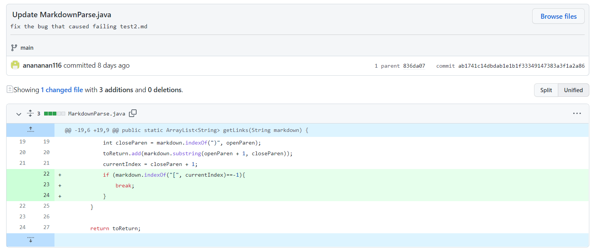
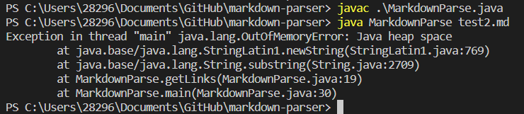
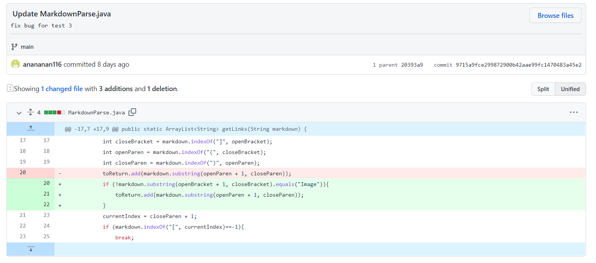
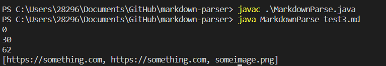
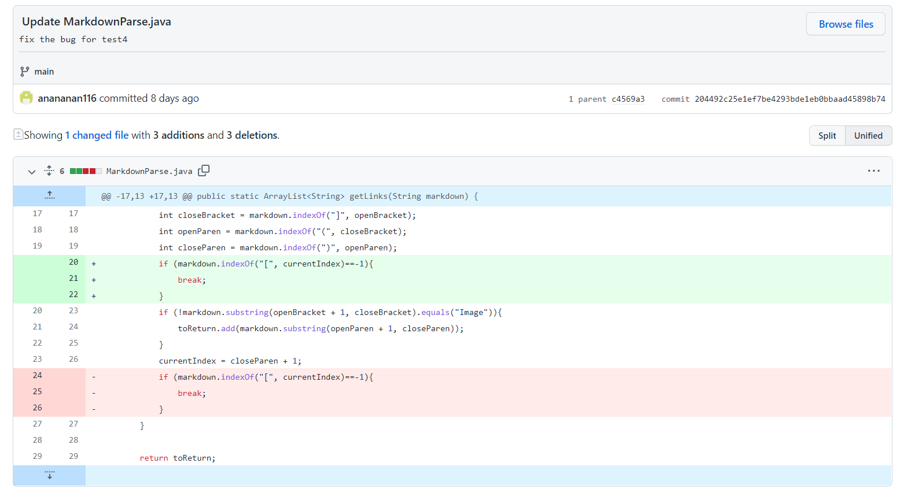
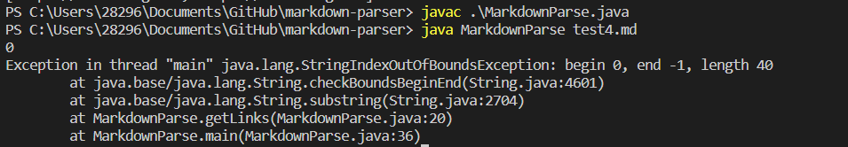

# This Is The Lab Report for Week 2 Lab<br />
<br />

 I will show three code changes I had in the lab
<br />

## First Code change
<br />


<br />
<br />

I added these three lines of code

```
if (markdown.indexOf("[", currentIndex)==-1){
    break;
}
```
<br />

[Link](https://github.com/anananan116/markdown-parser/blob/main/test2.md) for the test file input that this error appears

<br />


symptom before fix this bug:

<br />



<br />

If the md file does not end with a link, this bug will appear for the original program. This is because currentIndex will go back to -1 after all the link is found in the file. The condition for while loop is `(currentIndex < markdown.length())`. After `currentIndex = closeParen + 1;` currentIndex will be 0, and the condition is still satisfied, so the loop will not end. After I add the three lines of code, if currentIndex goes to -1, it will stop the loop.


<br />
<br />

## Second Code change
<br />


<br />
<br />

I added these three lines of code

```
if (!markdown.substring(openBracket + 1, closeBracket).equals("Image")){
    toReturn.add(markdown.substring(openParen + 1, closeParen));
}
```

<br />

[Link](https://github.com/anananan116/markdown-parser/blob/main/test3.md) for the test file input that this error appears

<br />


symptom before fix this bug:

<br />



<br />

This bug appears when there's a image embeded in md file. Image in md file share a similar format as link: `[]()`. So, the original program will also find all the link for images. After I made the change, the if statement will check if the bracket before the link has the format of `[Image]`. If so, it will not record this link for image.

<br />
<br />

## Third Code change
<br />


<br />
<br />

I changed the position of these two section of code:

```
if (markdown.indexOf("[", currentIndex)==-1){
    break;
}
```


```
if (!markdown.substring(openBracket + 1, closeBracket).equals("Image")){
    toReturn.add(markdown.substring(openParen + 1, closeParen));
}
```

<br />

[Link](https://github.com/anananan116/markdown-parser/blob/main/test4.md) for the test file input that this error appears

<br />


symptom before fix this bug:

<br />



<br />

This bug will appear if there's no any image or link in the md file. If there are no anything in the format of `[]()`, openBracket and closeBracket will both have a value of -1. So, the if statement will become:`if (!markdown.substring(0, -1).equals("Image"))`, which is clearly out of boundary for any String because of the index -1. The solution here is to put the break statement before this if statement, so that if there're no links in this md file, then it will stop the loop to prevent next lines of code to run.

<br />
<br />

The End:
---

**Thank you for reading this lab report.** <br/>
**See next lab report here:**
[here](https://github.com/anananan116) (haven't been published, look at my github page.)